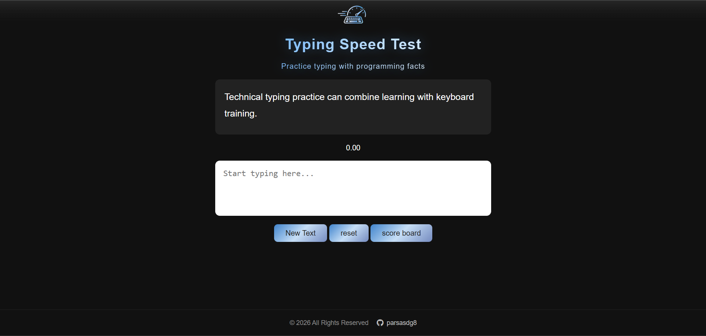
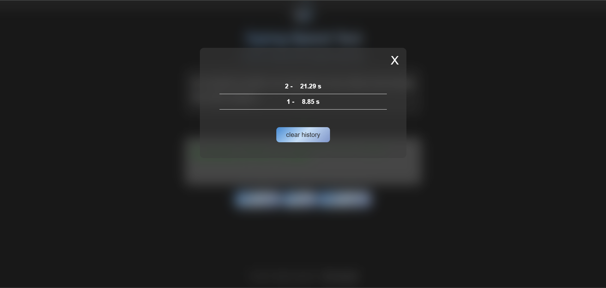

# ⌨️ تست سرعت تایپ با فکت‌های برنامه‌نویسی

[English](README.md) | [فارسی](README-fa.md)

یک برنامه ساده و تعاملی برای تست سرعت تایپ که با HTML، CSS و JavaScript خالص ساخته شده است.

در این پروژه به‌جای جملات تصادفی، از فکت‌های برنامه‌نویسی برای تمرین تایپ استفاده می‌شود. در هر تست، یک فکت به‌صورت تصادفی از یک فایل JSON انتخاب می‌شود، زمان موردنیاز برای تایپ آن اندازه‌گیری شده و نتیجه در مرورگر ذخیره می‌شود.

---

## 📸 پیش‌نمایش





---

## 📖 درباره پروژه

Programming Facts Typing Test یک برنامه تحت وب برای تمرین تایپ و اندازه‌گیری سرعت تایپ است که محتوای آن بر پایه فکت‌های برنامه‌نویسی طراحی شده است.

این برنامه شامل ۲۰۰ فکت برنامه‌نویسی است که در فایل `texts.json` قرار گرفته‌اند و در هر تست یکی از آن‌ها به‌صورت تصادفی نمایش داده می‌شود.

با شروع تایپ توسط کاربر، تایمر به‌صورت خودکار شروع می‌شود. زمانی که متن واردشده دقیقاً با متن نمایش داده‌شده مطابقت داشته باشد، تایمر متوقف شده و نتیجه در مرورگر با استفاده از `localStorage` ذخیره می‌شود.

این پروژه به‌عنوان یک پروژه عملی JavaScript برای ترکیب تمرین تایپ با مفاهیم برنامه‌نویسی و ذخیره‌سازی اطلاعات در مرورگر ساخته شده است.

---

## ✨ قابلیت‌ها

### ⌨️ تست سرعت تایپ

- تایپ فکت‌های برنامه‌نویسی به‌صورت تصادفی
- شروع خودکار تایمر هنگام تایپ
- توقف تایمر پس از تکمیل صحیح متن
- نمایش بازخورد هنگام تایپ
- غیرفعال شدن Input پس از تکمیل موفق تست

### 📚 فکت‌های برنامه‌نویسی

- شامل ۲۰۰ فکت برنامه‌نویسی
- ذخیره فکت‌ها در فایل جداگانه `texts.json`
- انتخاب تصادفی فکت برای هر تست
- پوشش موضوعات مختلف برنامه‌نویسی و توسعه وب

### 🎲 انتخاب متن تصادفی

برای هر تست یک فکت به‌صورت تصادفی از آرایه فکت‌ها انتخاب می‌شود.

### ⏱️ تایمر

زمان موردنیاز برای تکمیل هر تست با استفاده از موارد زیر اندازه‌گیری می‌شود:

- `Date.now()`
- `setInterval()`
- محاسبه میلی‌ثانیه

نتیجه بر اساس ثانیه و با دو رقم اعشار نمایش داده می‌شود.

### 📊 Scoreboard

برنامه دارای Scoreboard برای مشاهده نتایج قبلی است.

نتایج با استفاده از `localStorage` در مرورگر ذخیره می‌شوند و بعد از Refresh کردن صفحه نیز باقی می‌مانند.

### 🗑️ پاک کردن تاریخچه

با استفاده از دکمه **Clear History** می‌توان تمام نتایج ذخیره‌شده را حذف کرد.

### 🔄 ریست تست

کاربر می‌تواند تست فعلی را بدون Refresh کردن صفحه از ابتدا شروع کند.

### 📱 طراحی واکنش‌گرا

رابط کاربری برای اندازه‌های مختلف صفحه طراحی شده است:

- Desktop
- Laptop
- Tablet
- Mobile

---

## 🛠️ تکنولوژی‌های استفاده‌شده

| تکنولوژی | کاربرد |
|---|---|
| HTML5 | ساختار صفحه |
| CSS3 | طراحی و Responsive Design |
| JavaScript | منطق و تعاملات برنامه |
| JSON | ذخیره فکت‌های برنامه‌نویسی |
| Fetch API | دریافت فکت‌ها از `texts.json` |
| LocalStorage | ذخیره نتایج تایپ |
| Font Awesome | استفاده از آیکون‌ها |

---

## 📄 فکت‌های برنامه‌نویسی

این پروژه شامل فایل `texts.json` است که در آن ۲۰۰ فکت برنامه‌نویسی قرار دارد.

موضوعات این فکت‌ها شامل موارد زیر هستند:

- JavaScript
- Python
- C
- C++
- Java
- C#
- PHP
- HTML
- CSS
- Git و GitHub
- API
- REST API
- HTTP و HTTPS
- JSON
- SQL
- PostgreSQL
- SQLite
- MongoDB
- Backend Development
- Frontend Development
- Web Development
- مبانی شبکه
- مهندسی نرم‌افزار
- برنامه‌نویسی شیءگرا
- الگوریتم‌ها و ساختمان داده
- برنامه‌نویسی Async
- Frameworkها
- مبانی امنیت سایبری
- مفاهیم عمومی برنامه‌نویسی

---

## ⚡ نحوه عملکرد

روند کلی برنامه به شکل زیر است:

```text
اجرای سایت
    │
    ▼
دریافت texts.json
    │
    ▼
دریافت فکت‌های برنامه‌نویسی
    │
    ▼
انتخاب فکت تصادفی
    │
    ▼
نمایش متن
    │
    ▼
شروع تایپ توسط کاربر
    │
    ▼
شروع تایمر
    │
    ▼
مقایسه متن واردشده با متن اصلی
    │
    ├── اشتباه → ادامه تایپ
    │
    └── صحیح
           │
           ▼
       توقف تایمر
           │
           ▼
       ذخیره نتیجه
           │
           ▼
       LocalStorage
           │
           ▼
        Scoreboard
🧠 مفاهیم اصلی JavaScript

این پروژه چندین مفهوم کاربردی JavaScript را تمرین می‌کند.

Async / Await

فکت‌های برنامه‌نویسی به‌صورت Asynchronous از فایل JSON دریافت می‌شوند.

const response = await fetch("./texts.json");
const data = await response.json();
Fetch API

برای دریافت اطلاعات از فایل JSON از Fetch API استفاده شده است.

const response = await fetch("./texts.json");
انتخاب تصادفی

برای انتخاب یک فکت تصادفی از آرایه استفاده شده است.

const randomIndex = Math.floor(
    Math.random() * texts.length
);
LocalStorage

نتایج تست در مرورگر ذخیره می‌شوند.

localStorage.setItem(
    "typingScores",
    JSON.stringify(scores)
);
JSON

آرایه نتایج قبل از ذخیره شدن به JSON تبدیل می‌شود.

JSON.stringify(scores);

و هنگام اجرای مجدد برنامه دوباره به JavaScript Array تبدیل می‌شود.

JSON.parse(
    localStorage.getItem("typingScores")
);
DOM Manipulation

JavaScript بخش‌های مختلف صفحه را به‌صورت پویا تغییر می‌دهد، از جمله:

متن نمایش داده‌شده
تایمر
Input
Scoreboard
Modal
دکمه‌ها
استایل Input
Event Listener

برای مدیریت رویدادهای مختلف از Event Listener استفاده شده است:

تایپ کردن
انتخاب متن جدید
Reset
نمایش Scoreboard
بستن Modal
پاک کردن نتایج
Timer

تایمر با استفاده از setInterval() و Date.now() هر ۱۰ میلی‌ثانیه به‌روزرسانی می‌شود.

📂 ساختار پروژه
programming-facts-typing-test/
│
├── image/
│   ├── icon.png
│   ├── TST.png
│   ├── screenshot.png
│   └── screenshot2.png
│
├── texts.json
├── index.html
├── style.css
├── script.js
│
├── README.md
└── README-fa.md
💻 اجرای پروژه به‌صورت Local
1. کلون کردن Repository
git clone https://github.com/parsasdg8/programming-facts-typing-test.git
2. ورود به پوشه پروژه
cd programming-facts-typing-test

سپس پوشه پروژه را در ویرایشگر کد موردنظر خود باز کنید.

3. اجرای پروژه با Local Server

از آنجایی که برنامه فایل texts.json را با استفاده از Fetch API دریافت می‌کند، بهتر است پروژه با یک Local Development Server اجرا شود.

اگر از VS Code استفاده می‌کنید، می‌توانید از افزونه Live Server استفاده کنید.

سپس:

Right Click → Open with Live Server

برنامه فکت‌های برنامه‌نویسی را از فایل زیر دریافت می‌کند:

texts.json
🎯 هدف پروژه

این پروژه به‌عنوان یک پروژه عملی JavaScript برای تمرین و ترکیب چند مفهوم مهم توسعه وب ساخته شده است.

مفاهیم اصلی مورد استفاده:

DOM Manipulation
Event Handling
Async / Await
Fetch API
JSON
LocalStorage
Timers
Arrays
Dynamic HTML
Browser-based Data Storage
منطق پایه برنامه‌نویسی

استفاده از فکت‌های برنامه‌نویسی نیز باعث می‌شود تمرین تایپ برای برنامه‌نویسان کاربردی‌تر باشد، زیرا هم‌زمان با تمرین تایپ، مفاهیم مرتبط با برنامه‌نویسی نیز مرور می‌شوند.

```

👨‍💻 سازنده

Parsa Sadeghi


<a href="https://github.com/parsasdg8">  </a>
<a href="https://www.linkedin.com/in/parsa-sadeghi-141a0b389?utm_source=share_via&utm_content=profile&utm_medium=member_android">  </a> 

⭐ پروژه

اگر این پروژه برایتان جالب یا مفید بود، می‌توانید با دادن یک Star از آن حمایت کنید.
